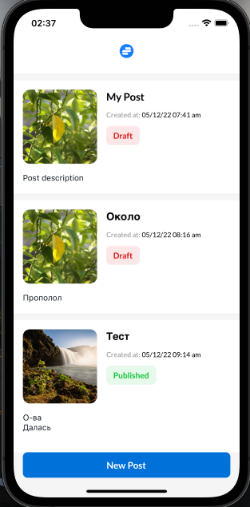
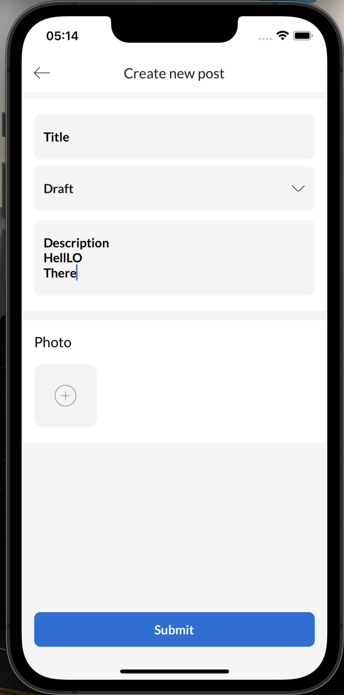

# Post Reader (React Native)
Assignment

**Screens**

<table>
<tr>
    <td>HomeScreen</td>
    <td>CreatePost</td>
 </tr> 
   <tr>
    <td></td>
    <td></td>
  </tr>
</table>

### Directory Structure

```
├── app
│   ├── assets
│   ├── components
│   ├── config
│   ├── constants
│   ├── screens
│   ├── store
│   ├── types
│   ├── utils
├── react-native.config
├── README.md
├── tsconfig.json
└── package.json
```

APP/:

**components**

This is folder with all components, which can be reusable in all project.

**type**

This is folder with types and interfaces.

**screens**

This is folder with entities, navigation ,screens , where every enteties can have one or more screens, self components which used only at current entity.

**store**

This is folder where all reducers combine into one.

**config**

Folder with all spacing, colors, and typography app configurations

**utils**

This is a place to put miscellaneous helpers and utilities.

**assets**

This is folder where fonts , icons , images are placed .


