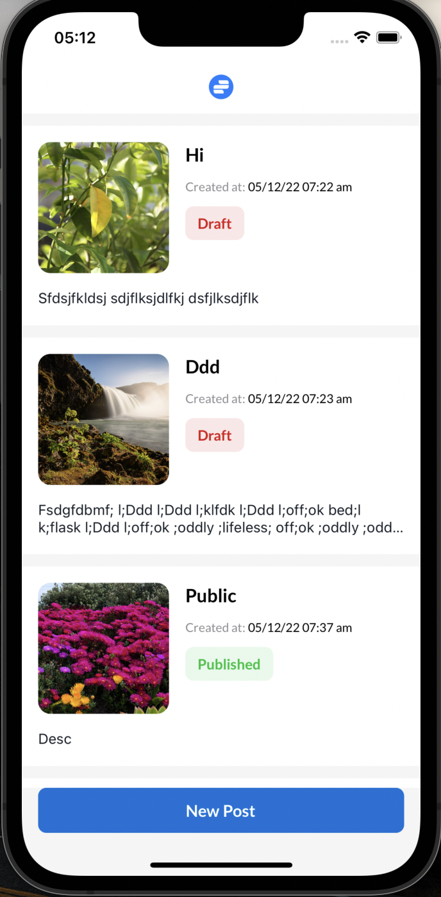

# Post Reader (React Native)
Assignment

**Screens**

<table>
<tr>
    <td>HomeScreen</td>
    <td>CreatePost</td>
 </tr> 
   <tr>
    <td></td>
    <td></td>
  </tr>
</table>

### Directory Structure

```
├── app
│   ├── assets
│   ├── components
│   ├── config
│   ├── constants
│   ├── screens
│   ├── store
│   ├── types
│   ├── utils
├── react-native.config
├── README.md
├── tsconfig.json
└── package.json
```

